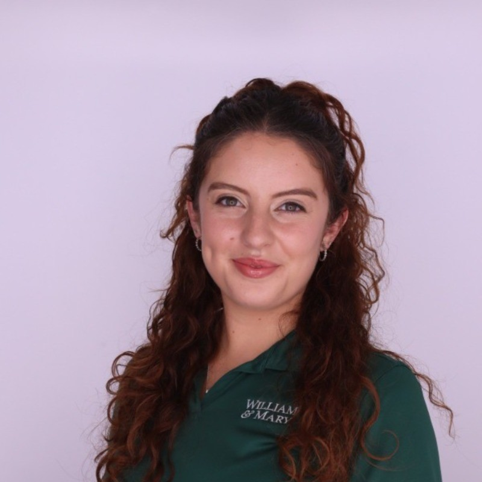
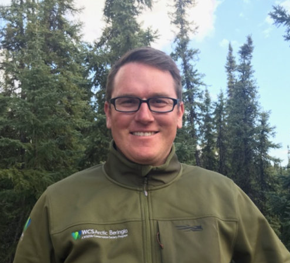

# Arctic Fisheries and Coastal Lagoons 

Geospatial analysis of Arctic coastal lagoons in Alaska using Python and Google Earth Engine (GEE) to monitor ecological changes such as algal blooms, ice coverage, connectivity, and seasonal variation.

## Project Overview
Climate change is reshaping Alaska’s fragile ecosystems, with warming weather driving seasonal shifts that threaten coastal habitats. William & Mary's Institute for Integrative Conservation (IIC) has partnered with the The Wildlife Conservation Society (WCS), which leads the Chukchi Sea Coastal Lagoon Monitoring project, to help provide insights to support researchers, conservationists, and local communities.

This project examines lagoons in the Chukchi and Beaufort Seas to determine ice coverage, lagoon connectivity, and algal growth. Using the collected data, an interactive ArcGIS Experience Builder application was created to assist conservation specialists and fishermen in monitoring habitat changes and spotting long-term patterns.

As of November 2025, the project is still producing interactive mapping tools and satellite-derived datasets that are vital resources for tracking the health of ecosystems and guiding conservation plans in Arctic lagoons. For more visit the [Experience Builder](https://experience.arcgis.com/experience/8ed468e285634b5f974ba3df4b8ee857/) Site, or WCS [Arctic Beringia Fish Ecology](https://leucichthys.org/) research site.

## Study Area

*Map created by Isabella Buckley William & Mary '25*

## Meet the Team

<table>
  <tr>
    <td align="center" width="33%">
      
       
      <b>Isabella Buckley</b>
       
      William & Mary '25
       
    </td>
      <td align="center" width="33%">
      
       
      <b>Aayla Kastning</b>
       
      William & Mary '26
       
    </td>
    <td align="center" width="33%">
      
       
      <b>Jack Zamary</b>
       
      William & Mary '27
       
    </td>
    <td align="center" width="33%">
      
       
      <b>Kevin Fraley</b>
       
      WCS Ecologist
       
    </td>
  </tr>
</table>

## Tools

  
  
  
  
  
  

