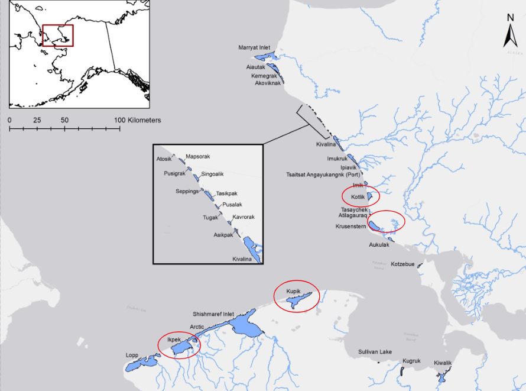
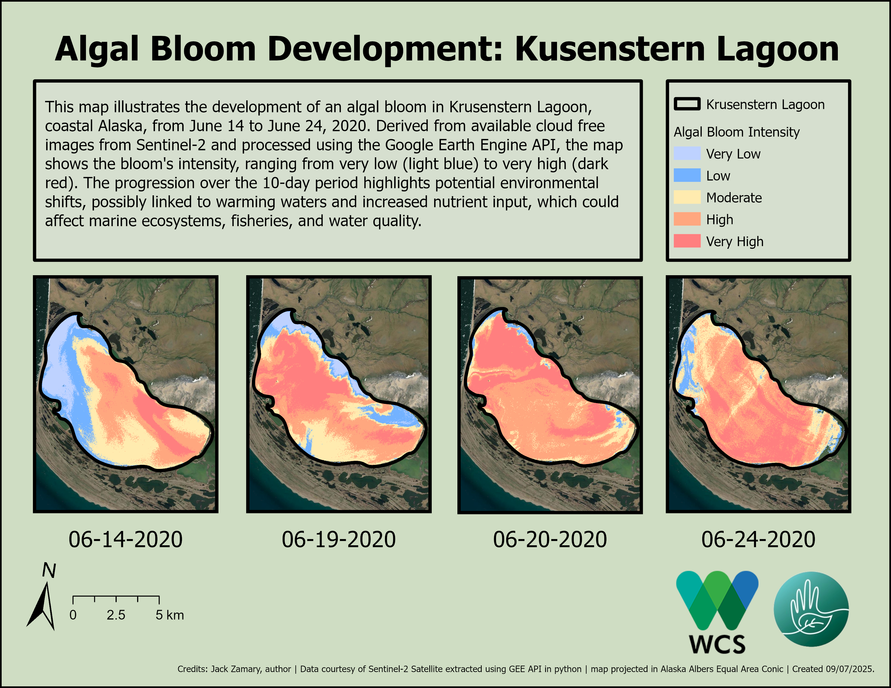

# Arctic Fisheries and Coastal Lagoons 
Geospatial analysis of Arctic coastal lagoons in Alaska using Python and Google Earth Engine (GEE) to monitor ecological changes such as algal blooms, ice coverage, and seasonal variation.

---

## Project Overview
Climate change is reshaping Alaska’s fragile ecosystems, with warming weather driving seasonal shifts that threaten coastal habitats. William & Mary's Institute for Integrative Conservation (IIC) has partnered with the The Wildlife Conservation Society (WCS), which leads the Chukchi Sea Coastal Lagoon Monitoring project, to help provide insights to support researchers, conservationists, and local communities.

This project examines lagoons in the Chukchi and Beaufort Seas to determine ice coverage, lagoon connectivity, and algal growth. The code currently uploaded to this Github repository focuses mainly on algae bloom monitoring and analysis. Using the collected data, an interactive ArcGIS Experience Builder application was created to assist conservation specialists and fishermen in monitoring habitat changes and spotting long-term patterns.

Satellite imagery is processed by a Python workflow that makes use of the Google Earth Engine (GEE) API. The Normalized Difference Water Index (NDWI) is used to identify lagoon bodies, and the Normalized Difference Chlorophyll Index (NDCI) is used to evaluate algal blooms.  Selected satellite images are processed as GeoTIFFs for additional analysis in ArcGIS Pro, and time-series datasets are exported as CSVs.

As of September 2025, the project is still producing interactive mapping tools and satellite-derived datasets that are vital resources for tracking the health of ecosystems and guiding conservation plans in Arctic lagoons. Fore more visit the Expirenc Builder, or WCS site.

---

## Study Area

*Map created by Isabella Buckley William & Mary '25*

  
 
    <b>Sample Maps of Algal Bloom Analysis and Bloom Development</b>
    
 Click the arrow to view more 

  

  

  ---

  

---

## Project Links

Visit the following links to learn more about the project and visualize some of the current data.

**Visualize the Data:** [Expirence Builder Site](https://experience.arcgis.com/experience/8ed468e285634b5f974ba3df4b8ee857/) 
**Learn More:** [Arctic Beringia Fish Ecology Website](https://leucichthys.org/home/chukchi-sea-coastal-lagoon-monitoring/) 
